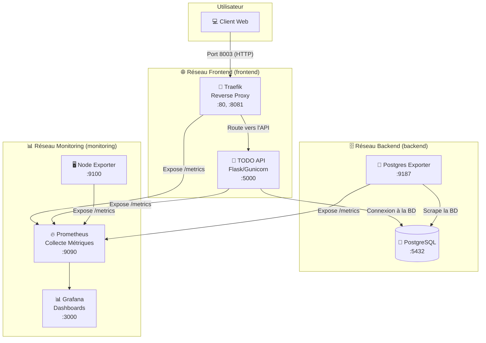

# 🚀 TODO App - Infrastructure Docker Compose Complète

[](https://www.docker.com/)
[](https://flask.palletsprojects.com/)
[](https://www.postgresql.org/)
[](https://traefik.io/)
[](https://prometheus.io/)
[](https://grafana.com/)
[](https://github.com/JuFiSec/todo-docker-infra/actions/workflows/ci.yml)

> **Auteur:** FIENI Dannie Innocent Junior  
> **Formation:** MCS 26.2 Cybersécurité & Cloud Computing - IPSSI Nice  
> **Projet:** TP Docker Compose - Infrastructure Complète avec Monitoring

## 🎯 Objectifs du Projet

Ce projet met en œuvre une infrastructure complète, de qualité production, pour une application de gestion de tâches. L'objectif était non seulement de répondre aux exigences du TP, mais aussi de les dépasser en intégrant des bonnes pratiques avancées en matière de DevOps, de sécurité et d'observabilité.

## ✨ Améliorations et Dépassement des Objectifs

En plus des fonctionnalités de base demandées, ce projet intègre de nombreuses améliorations significatives qui démontrent une compréhension approfondie des concepts de production :

* **Architecture et Réseautage Avancés :**
    * **Isolation Stricte :** Utilisation de 3 réseaux Docker distincts (`frontend`, `backend`, `monitoring`) pour segmenter les flux et renforcer la sécurité.
    * **Démarrage Contrôlé :** Usage de `depends_on` avec `condition: service_healthy` pour garantir que les services démarrent dans le bon ordre.

* **Dockerfile Multi-Stage et Sécurisé :**
    * **Images Optimisées :** Le `Dockerfile` de l'API utilise une construction *multi-stage* pour produire une image finale légère et épurée.
    * **Sécurité renforcée :** L'application ne tourne pas en tant que `root` mais avec un utilisateur dédié non-privilégié (`appuser`).

* **API Robuste et Complète :**
    * **Endpoint de Statistiques (`/api/stats`) :** Ajout d'une route fournissant des métriques métier.
    * **Instrumentation pour Prometheus :** L'API expose un endpoint `/metrics`, permettant un monitoring applicatif direct.

* **Base de Données Optimisée :**
    * **Performance Améliorée :** Ajout d'index (`CREATE INDEX`) pour accélérer les requêtes.
    * **Automatisation :** Création d'un *trigger* PostgreSQL pour mettre à jour automatiquement les dates de modification.

* **Suite d'Automatisation Professionnelle :**
    * Création de multiples scripts shell (`deploy.sh`, `test-infrastructure.sh`, `demo.sh`) pour automatiser le déploiement et les tests.

* **Intégration Continue (CI/CD) avec GitHub Actions :**
    * Mise en place d'un workflow qui teste automatiquement l'infrastructure et inclut un scan de sécurité avec Trivy.

## 🏗️ Architecture



## 🚀 Installation et Déploiement

```bash
# 1. Cloner le repository
git clone [https://github.com/JuFiSec/todo-docker-infra.git](https://github.com/JuFiSec/todo-docker-infra.git)
cd todo-docker-infra

# 2. Configurer l'environnement (ne pas modifier pour le test initial)
cp .env.example .env

# 3. Rendre les scripts exécutables et démarrer
chmod +x ./scripts/*.sh
./scripts/deploy.sh start
```

## 🌐 Accès aux Services

Cette section détaille comment accéder à chaque service de l'infrastructure une fois celle-ci démarrée.

### Interfaces Principales

* **API TODO List**
    * **URL :** `http://localhost:8003/api/tasks`
    * **Description :** Le point d'entrée principal pour interagir avec l'application.

* **Dashboard Grafana**
    * **URL :** `http://localhost:3000`
    * **Description :** L'interface de visualisation pour tous les dashboards de monitoring.
    * **Identifiants :** `admin` / `admin_securise_2025`

* **Dashboard Traefik**
    * **URL :** `http://localhost:8081`
    * **Description :** Permet de visualiser l'état du reverse proxy, les routes actives et les services découverts.

### Interfaces de Monitoring & Débogage

* **Interface Prometheus**
    * **URL :** `http://localhost:9090`
    * **Description :** Pour explorer les métriques brutes, exécuter des requêtes PromQL et vérifier le statut des cibles de scraping (`/targets`).

* **Métriques des Services (Exporters)**
    * **Système :** `http://localhost:9100/metrics` (Node Exporter)
    * **PostgreSQL :** `http://localhost:9187/metrics` (Postgres Exporter)

### Accès Direct à la Base de Données

Vous pouvez vous connecter à la base de données PostgreSQL avec un client SQL (comme DBeaver, DataGrip, ou `psql` en ligne de commande) en utilisant les informations suivantes :

* **Hôte :** `localhost`
* **Port :** `5432`
* **Base de données :** `todo_app`
* **Utilisateur :** `todo_user`
* **Mot de passe :** `motdepasse_securise_2025` (défini dans votre fichier `.env`)

## ✅ Preuves de Fonctionnement

*Instructions : Après avoir lancé `./scripts/deploy.sh start`, prenez les captures d'écran et nommez-les comme indiqué ci-dessous dans le dossier `/screenshots`.*

1.  **Statut des conteneurs :** ``
2.  **Tableau de bord Traefik :** ``
3.  **Cibles Prometheus :** ``
4.  **Dashboard Grafana :** ``
5.  **Test de l'API :** `` et ``

---
## 📝 Licence

Ce projet est distribué sous la **Licence MIT**. Voir le fichier `LICENSE` pour plus de détails.